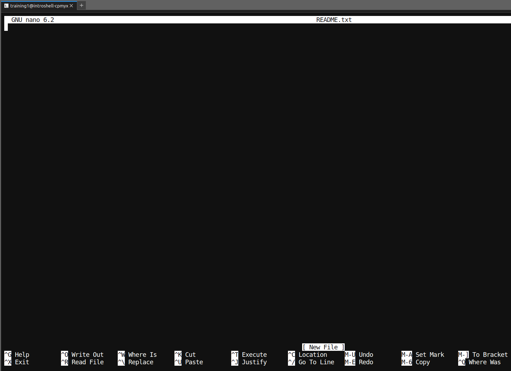
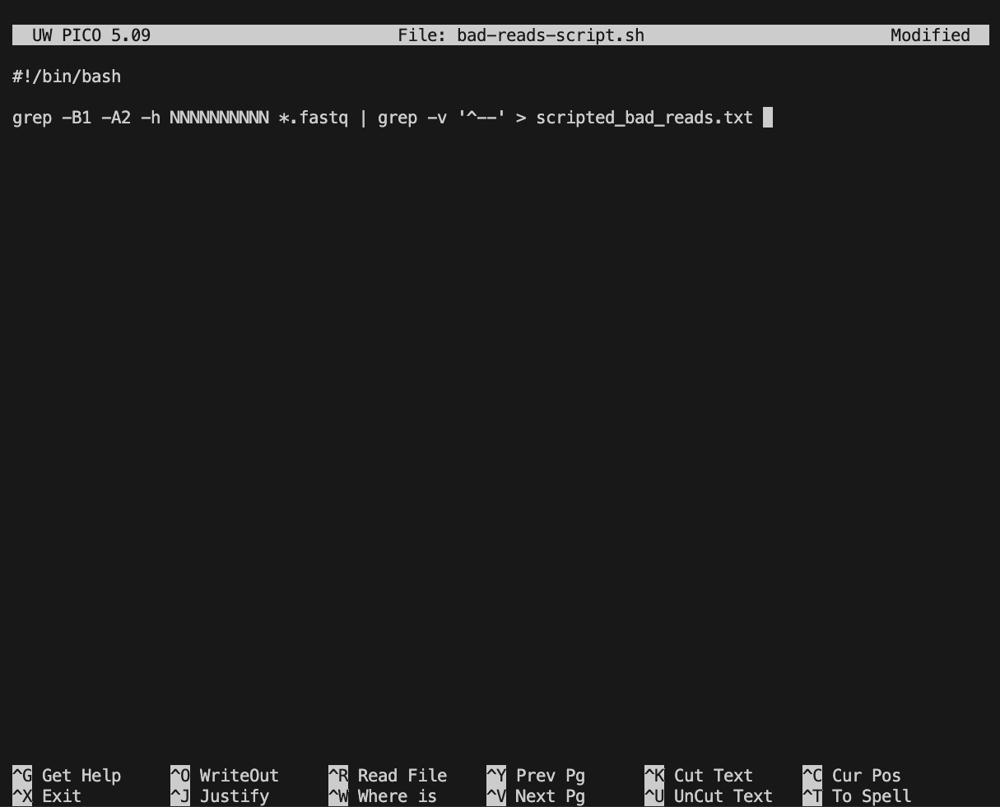

# 5. Writing Scripts and Working with Data


!!! clipboard-list "Lesson objectives"

    - Use the `nano` text editor to modify text files.
    - Write a basic shell script.
    - Use the `bash` command to execute a shell script.
    - Use `chmod` to make a script an executable program.

!!! clipboard-question "questions"

    - How can we automate a commonly used set of commands?


## Writing files

We've been able to do a lot of work with files that already exist, but what if we want to write our own files? We're not going to type in a FASTA file, but we'll see as we go through other tutorials, there are a lot of reasons we'll want to write a file, or edit an existing file.

To add text to files, we're going to use a text editor called Nano. We're going to create a file to take notes about what we've been doing with the data files in `~/shell_data/untrimmed_fastq`.

This is good practice when working in bioinformatics. We can create a file called `README.txt` that describes the data files in the directory or documents how the files in that directory were generated. As the name suggests, it's a file that we or others should read to understand the information in that directory.

Let's change our working directory to `~/shell_data/untrimmed_fastq` using `cd`,
then run `nano` to create a file called `README.txt`:

!!! terminal "code"

    ```bash
    $ cd ~/shell_data/untrimmed_fastq
    $ nano README.txt
    ```

You should see something like this:



The text at the bottom of the screen shows the keyboard shortcuts for performing various tasks in `nano`. We will talk more about how to interpret this information soon.


!!! circle-info "Which Editor?"

    When we say, "`nano` is a text editor," we really do mean "text": `nano` can
    only work with plain character data, not tables, images, or any other
    human-friendly media. We use `nano` in examples because it is one of the
    least complex text editors. However, because of this trait, `nano` may
    not be powerful enough or flexible enough for the work you need to do
    after this workshop. On Unix systems (such as Linux and Mac OS X),
    many programmers use [Emacs](https://www.gnu.org/software/emacs/) or
    [Vim](https://www.vim.org/) (both of which require more time to learn),
    or a graphical editor such as
    [Gedit](https://projects.gnome.org/gedit/). On Windows, you may wish to
    use [Notepad++](https://notepad-plus-plus.org/). Windows also has a built-in
    editor called `notepad` that can be run from the command line in the same
    way as `nano` for the purposes of this lesson.

    No matter what editor you use, you will need to know the default location where it searches
    for files and where files are saved. If you start an editor from the shell, it will (probably)
    use your current working directory as its default location. If you use
    your computer's start menu, the editor may want to save files in your desktop or
    documents directory instead. You can change this by navigating to
    another directory the first time you "Save As..."


Let's type in a few lines of text. Describe what the files in this
directory are or what you've been doing with them.
Once we're happy with our text, we can press <kbd>Ctrl</kbd>\-<kbd>O</kbd> (press the <kbd>Ctrl</kbd> or <kbd>Control</kbd> key and, while
holding it down, press the <kbd>O</kbd> key) to write our data to disk. You'll be asked what file we want to save this to:
press <kbd>Return</kbd> to accept the suggested default of `README.txt`.

Once our file is saved, we can use <kbd>Ctrl</kbd>\-<kbd>X</kbd> to quit the `nano` editor and
return to the shell.


!!! circle-info "Control, Ctrl, or ^ Key"

    The Control key is also called the "Ctrl" key. There are various ways
    in which using the Control key may be described. For example, you may
    see an instruction to press the <kbd>Ctrl</kbd> key and, while holding it down,
    press the <kbd>X</kbd> key, described as any of:

    - `Control-X`
    - `Control+X`
    - `Ctrl-X`
    - `Ctrl+X`
    - `^X`
    - `C-x`

    In `nano`, along the bottom of the screen you'll see `^G Get Help ^O WriteOut`.
    This means that you can use <kbd>Ctrl</kbd>\-<kbd>G</kbd> to get help and <kbd>Ctrl</kbd>\-<kbd>O</kbd> to save your
    file.


Now you've written a file. You can take a look at it with `less` or `cat`, or open it up again and edit it with `nano`.


!!! dumbbell "Exercise"

    Open `README.txt` and add the date to the top of the file and save the file.

    ??? success "Solution"

        Use `nano README.txt` to open the file.  
        Add today's date and then use <kbd>Ctrl</kbd>\-<kbd>X</kbd> followed by `y` and <kbd>Enter</kbd> to save.

## Writing scripts

A really powerful thing about the command line is that you can write scripts. Scripts let you save commands to run them and also lets you put multiple commands together. Though writing scripts may require an additional time investment initially, this can save you time as you run them repeatedly. Scripts can also address the challenge of reproducibility: if you need to repeat an analysis, you retain a record of your command history within the script.

One thing we will commonly want to do with sequencing results is pull out bad reads and write them to a file to see if we can figure out what's going on with them. We're going to look for reads with long sequences of N's like we did before, but now we're going to write a script, so we can run it each time we get new sequences, rather than type the code in by hand each time.

We're going to create a new file to put this command in. We'll call it `bad-reads-script.sh`. The `sh` isn't required, but using that extension tells us that it's a shell script. Shell scripts can be opened by any text editor.  

!!! terminal "code"

    ```bash
    $ nano bad-reads-script.sh
    ```

Every script should start with a line that tells shell which interpreter to use and where the software is installed. The `#!` at the start of this path is called the [shebang or hashbang](https://en.wikipedia.org/wiki/Shebang_(Unix)). You will almost always be using bash and bash will almost always be at the path `/bin/bash`, so most of the time you'll copy this line exactly. If you want to use a different shell or a different language (*e.g.,* python) you can specify this here instead.  

!!! terminal "code"

    ```bash
    #!/bin/bash
    ```

Add the line above, then leave an empty line, then type in the code. Here we'll use some code we ran earlier.
 
!!! terminal "code"

    ```bash
    grep -B1 -A2 -h NNNNNNNNNN *.fastq | grep -v '^--' > scripted_bad_reads.txt
    ```

Bad reads have a lot of N's, so we're going to look for `NNNNNNNNNN` with `grep`. We want the whole FASTQ record, so we're also going to get the one line above the sequence and the two lines below. We also want to look in all the files that end with `.fastq`, so we're going to use the `*` wildcard.

!!! circle-info "Custom `grep` control"

    We introduced the `-v` option in [the previous episode](04-redirection.md), now we
    are using `-h` to "Suppress the prefixing of file names on output" according to the documentation shown by `man grep`. You may have seen the prefixing earlier if you ran `grep -B1 -A2 NNNNNNNNNN *.fastq` as grep adds the sample name prefixing when the wildcard is expanded. 


Type your `grep` command into the script file and save it as before. It should look like this:




Now comes the neat part. We can run this script. Type:

!!! terminal "Code"

    ```bash
    $ bash bad-reads-script.sh
    ```

It will look like nothing happened, but now if you look at `scripted_bad_reads.txt`, you can see that there are now reads in the file.


!!! dumbbell "Exercise"

    We want the script to tell us when it's done.
    
    1. Open `bad-reads-script.sh` and add the line `echo "Script finished!"` after the `grep` command and save the file.
    2. Run the updated script.

    ??? success "Solution"

        ```
        $ bash bad-reads-script.sh
        Script finished!
        ```


## Moving and Downloading Data

So far, we've worked with data that is pre-loaded on the instance in the cloud. Usually, however,
most analyses begin with moving data onto the instance. Below we'll show you some commands to
download data onto your instance, or to move data between your computer and the cloud.

!!! cloud-down "Getting data from the cloud"

    There are two programs that will download data from a remote server to your local
    (or remote) machine: `wget` and `curl`. They were designed to do slightly different
    tasks by default, so you'll need to give the programs somewhat different options to get
    the same behaviour, but they are mostly interchangeable.

    - `wget` is short for "world wide web get", and it's basic function is to _download_
      web pages or data at a web address.

    - `cURL` is a pun, it is supposed to be read as "see URL", so its basic function is
      to _display_ webpages or data at a web address.

    Which one you need to use mostly depends on your operating system, as most computers will
    only have one or the other installed by default.

    Let's say you want to download some data from Ensembl. We're going to download a very small
    tab-delimited file that just tells us what data is available on the Ensembl bacteria server.
    Before we can start our download, we need to know whether we're using `curl` or `wget`.

    To see which program you have, type:

    ```bash
    $ which curl
    $ which wget
    ```

    `which` is a BASH program that looks through everything you have
    installed, and tells you what folder it is installed to. If it can't
    find the program you asked for, it returns nothing, i.e. gives you no
    results.

    On Mac OSX, you'll likely get the following output:

    ```bash
    $ which curl
    ```

    ```output
    /usr/bin/curl
    ```

    ```bash
    $ which wget
    ```

    ```output
    $
    ```

    This output means that you have `curl` installed, but not `wget`.

    Once you know whether you have `curl` or `wget`, use one of the
    following commands to download the file:

    ```bash
    $ cd
    $ wget ftp://ftp.ensemblgenomes.org/pub/release-37/bacteria/species_EnsemblBacteria.txt
    ```

    or

    ```bash
    $ cd
    $ curl -O ftp://ftp.ensemblgenomes.org/pub/release-37/bacteria/species_EnsemblBacteria.txt
    ```

    Since we wanted to _download_ the file rather than just view it, we used `wget` without
    any modifiers. With `curl` however, we had to use the -O flag, which simultaneously tells `curl` to
    download the page instead of showing it to us **and** specifies that it should save the
    file using the same name it had on the server: species_EnsemblBacteria.txt

    It's important to note that both `curl` and `wget` download to the computer that the
    command line belongs to. So, if you are logged into AWS on the command line and execute
    the `curl` command above in the AWS terminal, the file will be downloaded to your AWS
    machine, not your local one.


!!! graduation-cap "keypoints"

    - Scripts are a collection of commands executed together.
    - Transferring information to and from virtual and local computers.


